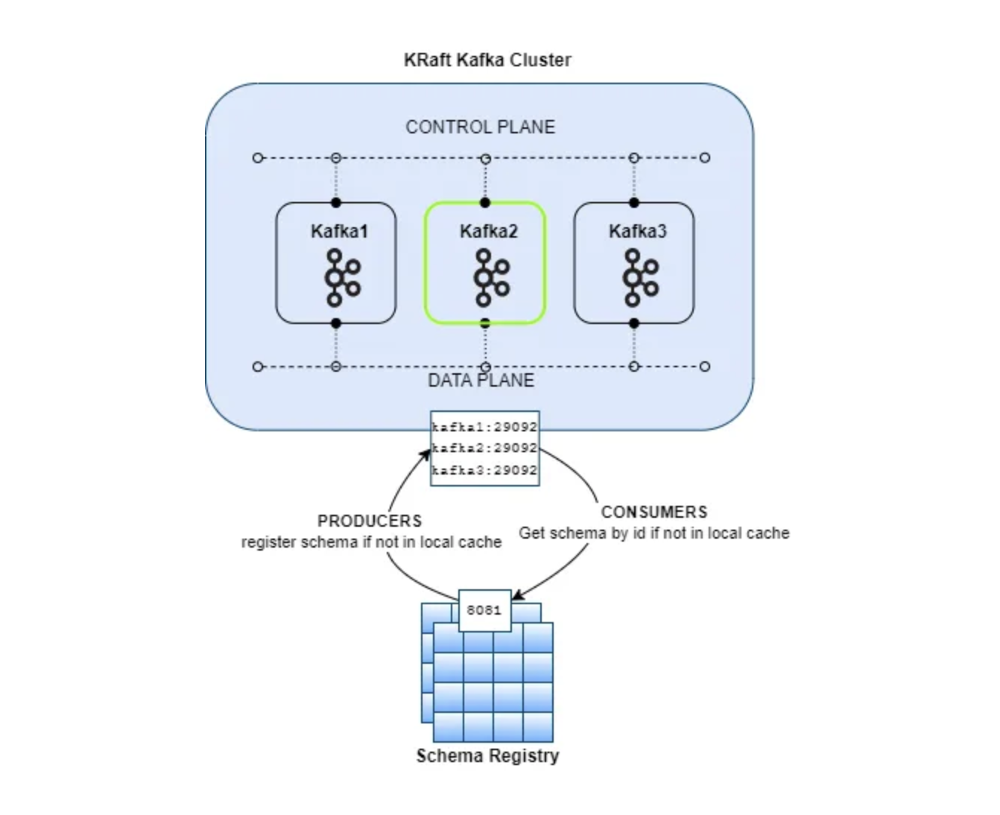
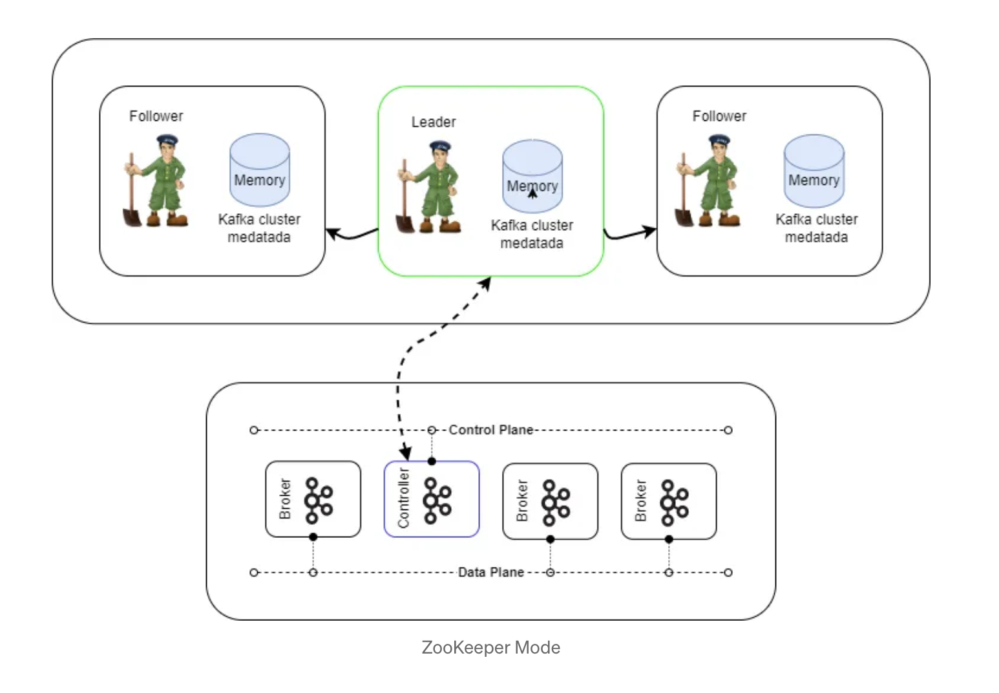
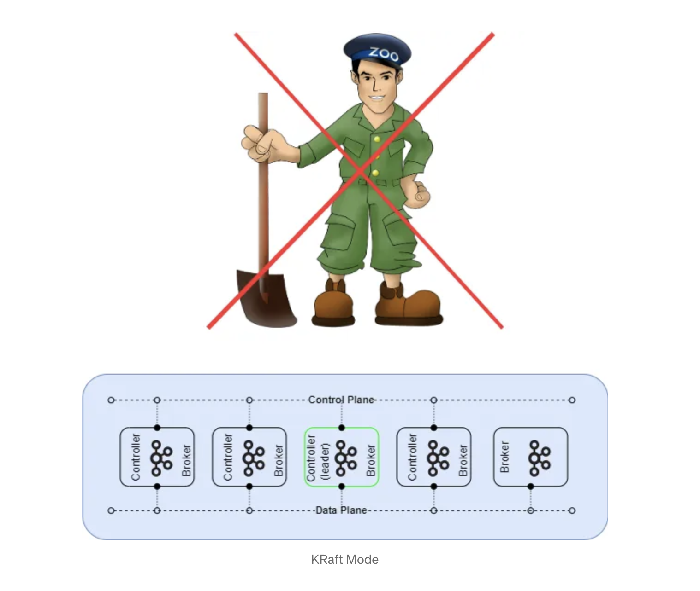

# kafka-kraft-cluster



- 3 nodes
- UI using `kafka UI` http://localhost:8080/
- UI using `kouncil` http://localhost:8082/

## How to run

```
docker-compose up -d
```

Before connecting to cluster from outside docker ( ex from your docker host - your PC ), we also need to config host file:


Example:
```
cat /etc/hosts

127.0.0.1 kafka01
127.0.0.1 kafka02
127.0.0.1 kafka03

```
### Done !


### Kafka Node Configuration
The Kafka nodes are configured with the required properties for KRaft:
* `KAFKA_NODE_ID`: The 32-bit ID uniquely identifying the Kafka node.
* `KAFKA_NODE_ID`: The 32-bit ID uniquely identifying the Kafka node.
* `KAFKA_CONTROLLER_LISTENER_NAMES`: Comma-separated names used by the controller. In KRaft mode it must be set because the default is the `PLAINTEXT` protocol.
* `KAFKA_LISTENER_SECURITY_PROTOCOL_MAP`: Maps listener names to the corresponding security protocols. We assigned three listeners (`CONTROLLER`, `INTERNAL`, and `EXTERNAL`) to the un-authenticated and non-encrypted `PLAINTEXT` security protocol.
* `KAFKA_LISTENERS`: The address on which the server listens. `CONTROLLER` is for controller quorum communication, `INTERNAL` is for internal communication between DATA PLANE brokers (our mixed nodes belong to both DATA PLANE and CONTROL PLANE), as well as for clients on the same network as the brokers (such as Schema Registry). EXTERNAL is for communication with clients outside the broker’s network, such as an application running on your computer connecting to the Kafka cluster running in Docker.
* `KAFKA_ADVERTISED_LISTENERS`: The address advertised to the clients. If not set, it defaults to the `KAFKA_LISTENERS`.
* `KAFKA_CONTROLLER_QUORUM_VOTERS`: Comma-separated list of controller voters, using the format `{controller-id}@{controller-host):{controller-port}`. Controllers in the quorum use port `29093`.
* `KAFKA_PROCESS_ROLES`: Specifies the role of the node: broker, controller, or both (in the case of mixed nodes).
* `CLUSTER_ID`: A unique 16-byte base64 UUID for the cluster. Can be generated online, or with or with `bin/kafka-storage.sh` random-uuid.
* `KAFKA_LOG_DIRS`: Comma-separated list of directories to store the log files.
* `KAFKA_GROUP_INITIAL_REBALANCE_DELAY_MS`: The delay used by the GroupCoordinator to start the initial rebalance, when the first member joins an empty group.
* `KAFKA_OFFSETS_TOPIC_REPLICATION_FACTOR`: Replication factor for the `__kafka_offsets` , the topic storing committed offsets. Default is 1 but we adjusted to 3 in our 3-brokers cluster.
* `KAFKA_TRANSACTION_STATE_LOG_REPLICATION_FACTOR`: Replication factor for the `__transaction_state`, the topic that stores the transaction state, and is automatically created at the first request to transactional API.

### Schema Registry Configuration
The schema registry configuration includes the following properties:
`SCHEMA_REGISTRY_HOST_NAME`: Advertised host name, required for intercommunication between multiple instances of Schema Registry.
`SCHEMA_REGISTRY_KAFKASTORE_BOOTSTRAP_SERVERS`: List of Kafka brokers to connect to.
`SCHEMA_REGISTRY_LISTENERS`: Comma-separated list of listeners for API requests supporting HTTP or HTTPS. Defaults to `http://0.0.0.0.8081`.


## Generation Kafka Architecture
### ZooKeeper Mode



### KRaft Mode


https://levelup.gitconnected.com/kraft-the-next-generation-kafka-architecture-424e70f8481b

## Ref
1. Confluent’s [cp-all-in-one-kraft](https://github.com/confluentinc/cp-all-in-one/blob/7.4.0-post/cp-all-in-one-kraft/docker-compose.yml) setup.